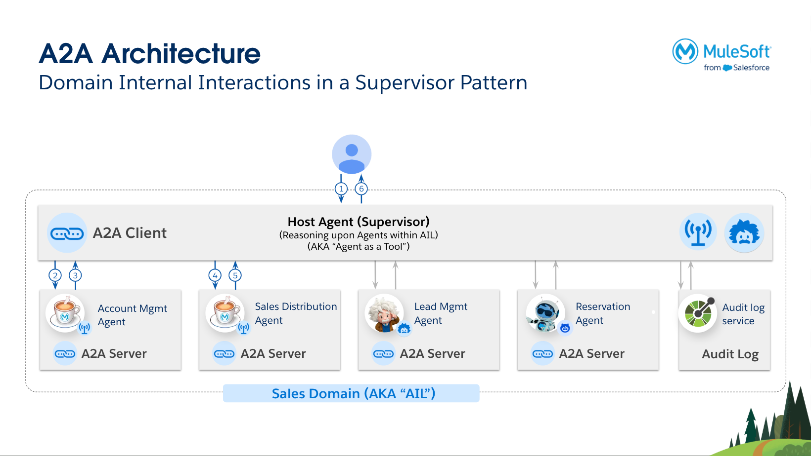
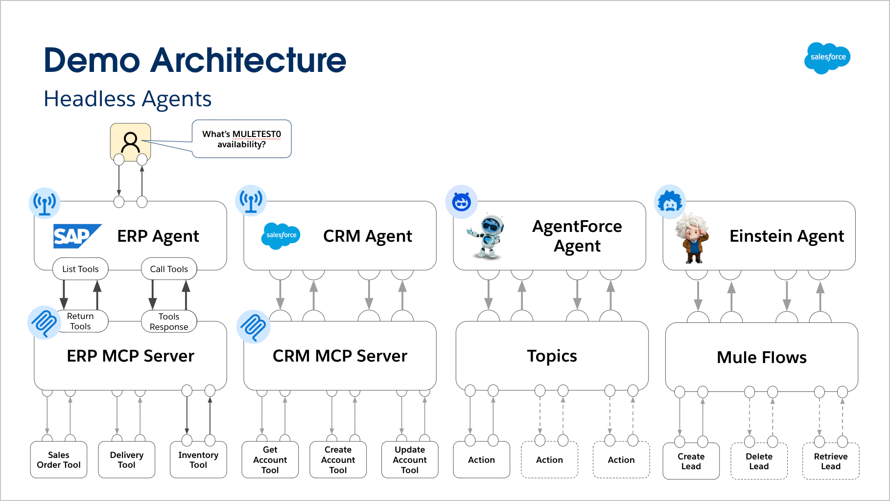

# A2A AIL Demo - Agent-to-Agent Integration and Learning Demonstration

## Overview

The **A2A AIL Demo** (Agent-to-Agent Integration and Learning Demonstration) is a comprehensive showcase of modern AI-powered integration patterns using MuleSoft's A2A (Agent-to-Agent) connector and various AI platforms. This demonstration illustrates how different specialized agents can work together to solve complex business problems through intelligent orchestration and seamless integration.

## 📋 Table of Contents

- [🎥 Video Tutorial](#-tutorial)
- [🏗️ Architecture](#️-architecture)
- [📁 Applications](#-applications)
  - [🤖 Specialized Agents](#-specialized-agents)
  - [🎯 Domain Orchestration Agent](#-domain-orchestration-agent)
  - [🔧 MCP Servers (Model Context Protocol)](#-mcp-servers-model-context-protocol)
  - [📊 Supporting Services](#-supporting-services)
- [🛠️ Technology Stack](#️-technology-stack)
- [🔒 Security & Authentication](#-security--authentication)
- [📦 Release History](#-release-history)
- [🚀 Getting Started](#-getting-started)
  - [Prerequisites](#prerequisites)
  - [Configuration Steps](#configuration-steps)
- [💡 Usage Examples](#-usage-examples)
  - [Web UI Interaction](#web-ui-interaction)
  - [Sample Conversations](#sample-conversations)
  - [API Integration](#api-integration)
    - [Interaction Agent HTTP Endpoints](#interaction-agent-http-endpoints)
    - [WebSocket Integration](#websocket-integration)
    - [Individual Agent A2A Endpoints](#individual-agent-a2a-endpoints)
- [🔗 Integration Patterns](#-integration-patterns)
- [📈 Monitoring and Observability](#-monitoring-and-observability)
- [🔧 Development and Customization](#-development-and-customization)
- [🤝 Contributing](#-contributing)
- [📝 License](#-license)
- [🙋‍♀️ Support](#️-support)

## Video Tutorial
[Link to the video tutorial](https://www.youtube.com/watch?v=pL5IZ9HsJAM)

## 🏗️ Architecture

This demo demonstrates a multi-agent architecture where:
- **Specialized agents** handle specific areas within dedicated business domains (CRM, ERP, HR, etc.)
- **Domain agents** orchestrate and coordinate multiple specialized agents within their responsible domain
- **AI engines** (OpenAI, Einstein AI, Agentforce) power intelligent decision-making
- **MCP servers** provide standardized tool access for agents
- **Audit services** track all agent interactions for compliance and monitoring
- **Security layer** ensures enterprise-grade protection with comprehensive A2A policies, MCP  policies, core security policies and additional security controls, deployed using Flex Gateway in CloudHub 2.0 private spaces



## 📁 Applications

### 🤖 Specialized Agents

#### 1. **a2a-crm-headless-agent-app**
- **Template**: This template can be used for any type of specialised agent. In this example, we are focusing on a CRM agent with account mgmt responsibilities and skills. 
- **Approach**: The approach within this agent template showcases, how Agent workflows can be implemented using Inference Connector and MCP Connector. 
- **Agent Category**: Complex - This template can reason & evaluate upon user query and create an execution plan with detailed steps to answer. It also re-evaluates by observing the answer it retrieves from various tool usages.
- **Purpose**: CRM operations specialist
- **Capabilities**: 
  - Account management (CRUD operations) (Used in this example)
- **Skills**: Get Accounts, Create Accounts, Update Accounts, Delete Accounts
- **Integration**: Uses MCP connector to communicate with CRM systems
- **AI Engine**: OpenAI GPT-4o-mini
- **Deployment**: Private CloudHub 2.0 space
- **Security**: Protected by Flex Gateway with OAuth 2.0 Token Introspection and comprehensive A2A policies
- **Endpoint**: `/crm-agent`

#### 2. **a2a-erp-headless-agent-app**
- **Template**: This template can be used for any type of specialised agent. In this example, we are focusing on a ERP agent with Sales & Distribution Mgmt. responsibilities and skills. 
- **Approach**: The approach within this agent template showcases, how Agent workflows can be implemented using Inference Connector and its native MCP capabilities. 
- **Agent Category**: Complex - This template can reason & evaluate upon user query and create an execution plan with detailed steps to answer. It also re-evaluates by observing the answer it retrieves from various tool usages.
- **Purpose**: ERP operations specialist  
- **Capabilities**:
  - Inventory management
  - Sales order processing
  - Delivery processing
- **Skills**: Inventory Check, Sales Order, Process Delivery
- **Integration**: Uses MCP native integration of the Inference Connector to reason on available tools
- **AI Engine**: OpenAI GPT-4o-mini  
- **Deployment**: Private CloudHub 2.0 space
- **Security**: Protected by Flex Gateway with OAuth 2.0 Token Introspection and comprehensive A2A policies
- **Endpoint**: `/erp-agent`

#### 3. **a2a-einstein-ai-headless-agent-app**
- **Template**: This template can be used for any type of specialised agent. In this example, we are focusing on a CRM agent with Lead Mgmt. responsibilities and skills. 
- **Approach**: The approach within this agent template showcases, how Agent workflows can be implemented using Einstein Connector and making use of Mule Flows as tools. 
- **Agent Category**: Simple - This template can assess the users query and answers it without re-evaluation.
- **Purpose**: Lead management specialist using Einstein AI
- **Capabilities**:
  - Lead retrieval from HubSpot
  - Lead creation  
  - Lead deletion
- **Skills**: Get Leads, Create Leads, Delete Leads
- **AI Engine**: Salesforce Einstein AI (Models API)
- **Integration**: HubSpot connector
- **Deployment**: Private CloudHub 2.0 space
- **Security**: Protected by Flex Gateway with OAuth 2.0 Token Introspection and comprehensive A2A policies
- **Endpoint**: `/einstein-agent`

#### 4. **a2a-agentforce-headless-reservation-agent-app**
- **Template**: This template is for Agentforce Agents, which has been created in Agentforce. 
- **Approach**:  Agentforce Agent headless call.
- **Agent Category**: Simple - This templates is capable of saving the Agentforce SessionId mapped to the A2A Session Id, so the conversation from the user can refer to the Agentforce Session Id and history can be remembered by the Agent.
- **Purpose**: Reservation management specialist
- **Capabilities**: Automated reservation processing
- **Skills**: Submit Reservation
- **AI Engine**: Salesforce Agentforce
- **Deployment**: Private CloudHub 2.0 space
- **Security**: Protected by Flex Gateway with OAuth 2.0 Token Introspection and comprehensive A2A policies
- **Endpoint**: `/agentforce-agent`



### 🎯 Domain Orchestration Agent

#### **a2a-interaction-agent-app**
- **Template**: This template can be used for any type of domain agent. In this example, there is no specific focus on the domain. But you could use this as a domain agent for CRM and add the Account Mgmt, Lead Mgmt and Reservation Agents to it. You can also deploy this template multiple times with a different domain focus and dedicated specialised agents within. 
- **Approach**: The approach within this agent template showcases, how domain agents can be implemented with MuleSoft. This template has combined 2 approaches to show case the flexibility on how,
  - **(a)** - to use Inference Connector to be the LLM provider for the reasoning and tooling 
  - **(b)** - or the Einstein AI Connector (using the Models API) to be the LLM provider for the reasoning and tooling.
- **Agent Category**: Complex - This template can reason & evaluate upon user query and create an execution plan with detailed steps to answer. It also re-evaluates by observing the answer it retrieves from specialised agents.
- **Purpose**: Main orchestration hub and domain agent
- **Capabilities**:
  - Coordinates multiple specialized agents
  - Provides web-based UI for agent interactions
  - Manages conversation sessions
  - Routes requests to appropriate specialized agents
- **Features**:
  - Web UI at `/ui/*` for interactive agent conversations
  - WebSocket support for real-time communication  
  - Multi-agent orchestration
  - Session management
  - External service integration for audit logging
- **Skills**: Account Mgmt, Lead Mgmt, Reservation Mgmt, Opportunities, Contacts
- **AI Engine**: Option between OpenAI GPT-4o-mini (via Inference Connector) or OpenAI GPT-4.1 via Salesforce Einstein AI (Models API)
- **Deployment**: Private CloudHub 2.0 space
- **Security**: Protected by Flex Gateway with OAuth 2.0 Token Introspection and comprehensive A2A policies
- **Endpoint**: `/crm-domain-agent`

### 🔧 MCP Servers (Model Context Protocol)

#### **mcp-server-demo-crm**
- **Purpose**: Provides standardized tools for CRM operations
- **Security**: Protected by Flex Gateway with Client ID Enforcement, MCP Attribute-Based Access Control, and MCP Schema Validation
- **Deployment**: Private CloudHub 2.0 space
- **Authentication**: Client Credentials (Client ID and Client Secret)
- **Tools Available**:
  - `get_accounts` - Retrieve account information by ID or name
  - `create_accounts` - Create new accounts with full details
  - `update_accounts` - Update existing account information
- **Protocols**: Both SSE and Streamable HTTP connections
- **Integration**: Salesforce connector for CRM operations
- **Approach**: This approach showcases, how to use MCP Tooling by natively creating connectivity to the System of Record (in this case Salesforce) within a single Mule App.

#### **mcp-server-demo-erp**  
- **Purpose**: Provides standardized tools for ERP operations
- **Security**: Protected by Flex Gateway with Client ID Enforcement, MCP Attribute-Based Access Control, and MCP Schema Validation
- **Deployment**: Private CloudHub 2.0 space
- **Authentication**: Client Credentials (Client ID and Client Secret)
- **Tools Available**:
  - `get_inventory` - Check inventory levels for materials
  - `submit_order` - Create sales orders in ERP system
  - `submit_delivery` - Process deliveries for existing orders
- **Protocols**: Both SSE and Streamable HTTP connections
- **Integration**: SAP ECC system integration
- **Approach**: This approach showcases, how to use MCP Tooling by reusing existing APIs or external APIs and doing a callout with the HTTP Request Component.

### 📊 Supporting Services

#### **a2a-audit-log-external-service-api**
- **Purpose**: Centralized audit logging for all agent interactions
- **Capabilities**:
  - Tracks agent task requests and responses
  - Stores interaction history in MySQL database
  - Provides audit trail for compliance
- **Database Schema**: Sessions, tasks, agents, timestamps, messages
- **API**: REST API for capturing audit events
- **Specification**: The API Specification is provided under 'a2a-audit-log-external-service-api/api-spec/interaction-capture-api-1.0.3-fat-oas.zip' to be uploaded into Exchange.

#### **toxic-a2a-interaction-agent-app**
- **Purpose**: Testing/development variant of the interaction agent

## 🛠️ Technology Stack

### Core Technologies
- **MuleSoft Runtime**: 4.9.6+
- **A2A Connector**: 0.3.0-BETA (Agent-to-Agent communication)
- **MCP Connector**: 1.2.0 (Model Context Protocol)
- **Inference Connector**: 1.0.0 (OpenAI integration)
- **Einstein AI Connector**: 1.2.0 (Salesforce Einstein AI integration)

### AI/ML Integrations  
- **OpenAI**: GPT-4o-mini for natural language processing
- **Salesforce Einstein AI**: Native Salesforce AI capabilities
- **Salesforce Agentforce**: Advanced agent automation
- **MuleSoft Inference Connector**: 0.5.7

### Additional Connectors
- **HTTP Connector**: REST API integrations  
- **Salesforce Connector**: CRM operations
- **Database Connector**: MySQL audit logging
- **WebSocket Connector**: Real-time communication
- **File Connector**: File operations
- **Object Store Connector**: Session management

## 🔒 Security & Authentication

### Overview
This demo implements enterprise-grade security using MuleSoft Flex Gateway policies and OAuth 2.0 authentication to protect all components in the A2A ecosystem.

### Security Architecture

#### MCP Server Security
- **Deployment**: MCP servers are deployed in private CloudHub 2.0 spaces
- **Gateway Protection**: All MCP servers are secured behind Flex Gateway with:

**Core Security Policies:**
- **Client ID Enforcement Policy**: Restricts access to registered client applications only

**MCP-Specific Policies:**
- **MCP Attribute-Based Access Control Policy**: Controls access based on MCP attributes and user context
- **MCP Schema Validation Policy**: Validates MCP requests and responses against defined schemas

#### A2A Agent Security
- **Deployment**: All specialized A2A agents are deployed in private CloudHub 2.0 spaces
- **Gateway Protection**: All A2A agents are secured behind Flex Gateway with:

**Core Security Policies:**
- **OAuth 2.0 Token Introspection Policy**: Validates OAuth tokens for each request

**A2A-Specific Policies:**
- **A2A Agent Card**: Validates agent identity and capabilities
- **A2A PII Detector**: Automatically detects and protects Personally Identifiable Information
- **A2A Prompt Decorator**: Enhances prompts with security context and validation
- **A2A Schema Validation**: Validates all incoming and outgoing messages against defined schemas

- **Authentication**: Client Credential Grant Type (OAuth 2.0)
- **Access Control**: Only authorized applications with valid OAuth tokens can access A2A agents

### Authentication Flow

#### MCP Server Authentication Flow
1. **Client Registration**: Applications must be registered in Anypoint Platform
2. **Credential Generation**: Client ID and Client Secret are generated for each application
3. **Request Authentication**: Applications provide Client ID and Client Secret as HTTP headers
4. **Policy Enforcement**: Flex Gateway Client ID Enforcement Policy validates credentials and enforces access controls

#### A2A Agent Authentication Flow
1. **Client Registration**: Applications must be registered in external Identity Provider (Keycloak)
2. **Credential Generation**: Client ID and Client Secret are generated for each application in Keycloak
3. **Token Acquisition**: Applications obtain OAuth tokens by hitting Keycloak using Client Credential Grant
4. **Request Authentication**: Applications include valid OAuth tokens in requests
5. **Token Validation**: Flex Gateway OAuth 2.0 Token Introspection Policy validates tokens with Keycloak
6. **Policy Enforcement**: Additional A2A-specific policies enforce agent-specific security controls

### Configuration Requirements

#### Interaction Agent Configuration (a2a-interaction-agent-app)
```properties
# Agent URLs and Authentication (for A2A agents using Keycloak)
agent.erp.url=https://your-gateway-url/erp-agent
agent.erp.tokenUrl=https://your-keycloak-url/auth/realms/your-realm/protocol/openid-connect/token
agent.erp.clientId=your_erp_client_id
agent.erp.clientSecret=your_erp_client_secret

agent.crm.url=https://your-gateway-url/crm-agent
agent.crm.tokenUrl=https://your-keycloak-url/auth/realms/your-realm/protocol/openid-connect/token
agent.crm.clientId=your_crm_client_id
agent.crm.clientSecret=your_crm_client_secret

agent.agentforce.url=https://your-gateway-url/agentforce-agent
agent.agentforce.tokenUrl=https://your-keycloak-url/auth/realms/your-realm/protocol/openid-connect/token
agent.agentforce.clientId=your_agentforce_client_id
agent.agentforce.clientSecret=your_agentforce_client_secret

agent.einstein.url=https://your-gateway-url/einstein-agent
agent.einstein.tokenUrl=https://your-keycloak-url/auth/realms/your-realm/protocol/openid-connect/token
agent.einstein.clientId=your_einstein_client_id
agent.einstein.clientSecret=your_einstein_client_secret
```

#### Specialized Agent Configuration (e.g., a2a-crm-headless-agent-app)
```properties
# MCP Server Configuration
mcpserver.crm.url=https://your-gateway-url/mcp-crm
mcpserver.crm.clientId=your_mcp_client_id
mcpserver.crm.clientSecret=your_mcp_client_secret
```

## 📦 Release History

### Release 2.0 - Enterprise Security Enhancement
**Release Date**: August 2025

#### 🚀 Major Security Features Added
- **Flex Gateway Integration**: All components now deployed behind Flex Gateway for enterprise-grade security
- **CloudHub 2.0 Private Spaces**: All applications deployed in private CloudHub 2.0 spaces for enhanced isolation
- **OAuth 2.0 Authentication**: A2A agents now use OAuth 2.0 Token Introspection with external Keycloak IDP
- **Client ID Enforcement**: MCP servers protected with Client ID Enforcement Policy
- **MCP Security Policies**: Added MCP Attribute-Based Access Control and MCP Schema Validation policies
- **A2A Security Policies**: Comprehensive A2A policies including Agent Card, PII Detector, Prompt Decorator, and Schema Validation

#### 🔧 Technical Improvements
- **Hybrid Authentication**: MCP servers use simple Client ID/Secret authentication, A2A agents use full OAuth 2.0 flow
- **External IDP Integration**: Keycloak integration for A2A agent authentication
- **Enhanced Configuration**: Updated configuration structure to support security requirements
- **Production-Ready Security**: All components now meet enterprise security standards
- **Connector Updates**: Upgraded A2A Connector to 0.3.0-BETA, MCP Connector to 1.2.0, and Inference Connector to 1.0.0 for enhanced functionality and stability

#### 📋 Migration Notes
- **Breaking Changes**: Configuration files updated to include security properties
- **Authentication Changes**: A2A agents now require OAuth 2.0 tokens instead of simple credentials
- **Deployment Changes**: All applications must be deployed to CloudHub 2.0 private spaces
- **Gateway Requirements**: Flex Gateway required for production deployments

### Release 1.0 - Initial Release
**Release Date**: June 2025

#### 🎯 Core Features
- **Multi-Agent Architecture**: Specialized agents for CRM, ERP, Einstein AI, and Agentforce
- **A2A Communication**: Agent-to-Agent communication using MuleSoft A2A connector
- **MCP Integration**: Model Context Protocol servers for standardized tool access
- **Web UI**: Interactive web interface for agent conversations
- **Audit Logging**: Comprehensive audit trail for all agent interactions
- **Multi-Modal AI**: Support for OpenAI, Salesforce Einstein AI, and Agentforce

#### 🔧 Technical Foundation
- **MuleSoft Runtime 4.9.x+**: Core integration platform
- **A2A Connector 0.1.0-BETA**: Agent-to-Agent communication
- **MCP Connector 1.0.0**: Model Context Protocol support
- **Local Development**: Support for local development and testing
- **Basic Security**: HTTP-based communication with basic authentication

## 🚀 Getting Started

### Prerequisites
- MuleSoft Anypoint Studio
- Mule Runtime 4.9.6+
- **Flex Gateway** (for production deployments)
- **Anypoint Platform Access** (for client application registration)
- OpenAI API key
- Salesforce org with Einstein AI/Agentforce enabled
- MySQL database (for audit logging)
- SAP ECC system access (for ERP operations)
- HubSpot account (for lead management)
- **OAuth 2.0 Authorization Server** (for token management)

### Configuration Steps

1. **Clone and Import**
   ```bash
   # Each application needs to be imported separately into Anypoint Studio
   ```

2. **Configure Properties**
   
   For each application, copy the `config.properties.example` to `config.properties` and configure:

   **Common Properties:**
   ```properties
   # OpenAI Configuration
   openai.apikey=your_openai_api_key
   openai.model=gpt-4o-mini
   openai.maxToken=5000
   
   # Salesforce Configuration  
   salesforce.tokenUrl=https://your-org.salesforce.com/services/oauth2/token
   salesforce.clientId=your_client_id
   salesforce.clientSecret=your_client_secret
   ```

   **Agent URLs and Authentication (for interaction agent):**
   ```properties
   # Use secure HTTPS endpoints for production
   agent.erp.url=https://your-gateway-url/erp-agent
   agent.erp.tokenUrl=https://your-keycloak-url/auth/realms/your-realm/protocol/openid-connect/token
   agent.erp.clientId=your_erp_client_id
   agent.erp.clientSecret=your_erp_client_secret
   
   agent.crm.url=https://your-gateway-url/crm-agent
   agent.crm.tokenUrl=https://your-keycloak-url/auth/realms/your-realm/protocol/openid-connect/token
   agent.crm.clientId=your_crm_client_id
   agent.crm.clientSecret=your_crm_client_secret
   
   agent.agentforce.url=https://your-gateway-url/agentforce-agent
   agent.agentforce.tokenUrl=https://your-keycloak-url/auth/realms/your-realm/protocol/openid-connect/token
   agent.agentforce.clientId=your_agentforce_client_id
   agent.agentforce.clientSecret=your_agentforce_client_secret
   
   agent.einstein.url=https://your-gateway-url/einstein-agent
   agent.einstein.tokenUrl=https://your-keycloak-url/auth/realms/your-realm/protocol/openid-connect/token
   agent.einstein.clientId=your_einstein_client_id
   agent.einstein.clientSecret=your_einstein_client_secret
   ```

   **Database Configuration (for audit service):**
   ```properties
   db.host=your_mysql_host
   db.port=3306
   db.user=your_db_user
   db.password=your_db_password
   db.database=your_database_name
   ```

3. **Database Setup**
   
   Execute the SQL script for audit logging:
   ```sql
   CREATE TABLE audit_log (
       session_id VARCHAR(255) NOT NULL,
       task_id VARCHAR(255) NOT NULL,
       agent_name VARCHAR(255) NOT NULL,
       knowledge VARCHAR(100) NOT NULL,
       requested_at DATETIME,
       responded_at DATETIME,
       status VARCHAR(50),
       request_message TEXT,
       response_message TEXT,
       PRIMARY KEY (session_id, task_id, agent_name)
   );
   ```

4. **Deploy Applications**

   Deploy in the following order:
   1. `a2a-audit-log-external-service-api` (port 8081)
   2. `mcp-server-demo-crm` (port 8082)  
   3. `mcp-server-demo-erp` (port 8083)
   4. Individual agent applications (ports 8084-8088)
   5. `a2a-interaction-agent-app` (port 8081)

## 💡 Usage Examples

### Web UI Interaction
1. Navigate to `https://your-gateway-url/ui/agents.html`
2. Add one or more agent types (ERP, CRM, Agentforce, Einstein)
3. Start a conversation with natural language queries

### Sample Conversations

**ERP Agent:**
- "Check inventory for material MULETEST0"
- "Create a sales order for 5 units of MULETEST0"  
- "Process delivery for order 12345"

**CRM Agent:**  
- "Show me all accounts containing 'MuleSoft'"
- "Create a new account for Acme Corp"
- "Update account ABC123 with new billing address"

**Einstein Agent:**
- "Show me the top 10 leads"
- "Create a new lead for John Doe at john@example.com"
- "Delete lead with ID 54321"

### API Integration

#### Interaction Agent HTTP Endpoints

The **a2a-interaction-agent-app** provides several HTTP endpoints for programmatic interaction:

##### 1. Direct Agent Communication - `/prompt-agent`

Send messages directly to specific agents:

**Request:**
```bash
curl -X POST "https://your-gateway-url/prompt-agent?agentName=crmagent&userSessionId=user123" \
  -H "Content-Type: application/json" \
  -H "Authorization: Bearer YOUR_OAUTH_TOKEN" \
  -d '{
    "prompt": "Show me all accounts containing MuleSoft"
  }'
```

**Query Parameters:**
- `agentName`: Target agent (e.g., `crmagent`, `erpagent`, `einsteinagent`, `agentforceagent`)
- `userSessionId`: User session identifier for tracking conversations

**Response:**
```json
{
  "agentName": "Account Mgmt Agent",
  "agentAPIName": "crmagent", 
  "planNumber": 1,
  "agentTaskRequest": {
    "id": "abc123-def456-789",
    "sessionId": "user123",
    "message": {
      "parts": [
        {
          "text": "Show me all accounts containing MuleSoft"
        }
      ]
    }
  },
  "agentTaskResponse": {
    "id": "abc123-def456-789",
    "sessionId": "user123", 
    "status": {
      "state": "completed",
      "message": {
        "role": "agent",
        "parts": [
          {
            "type": "text",
            "text": "I found 3 accounts containing 'MuleSoft':\n1. MuleSoft Inc. (ID: 001xx000003DHP0)\n2. MuleSoft Partners LLC (ID: 001xx000003DHP1)\n3. MuleSoft Community (ID: 001xx000003DHP2)"
          }
        ]
      },
      "timestamp": "2024-01-15T10:30:45Z"
    },
    "artifacts": [
      {
        "name": "Answer",
        "index": 0,
        "parts": [
          {
            "type": "text", 
            "text": "I found 3 accounts containing 'MuleSoft'..."
          }
        ]
      }
    ]
  }
}
```

##### 2. General Prompt Processing - `/prompt`

Send natural language prompts for intelligent agent routing:

**Request (using default agents):**
```bash
curl -X POST "https://your-gateway-url/prompt?sessionId=user123&useTrustLayer=true&defaultAgents=true" \
  -H "Content-Type: application/json" \
  -d '{
    "prompt": "I need to check inventory for material MULETEST0 and then create a sales order"
  }'
```

**Request (using session-specific agent discovery):**
```bash
curl -X POST "https://your-gateway-url/prompt?sessionId=user123&userSessionId=user456&useTrustLayer=true" \
  -H "Content-Type: application/json" \
  -d '{
    "prompt": "I need to check inventory for material MULETEST0 and then create a sales order"
  }'
```

**Alternative Request (parameters in body, session-specific discovery):**
```bash
curl -X POST "https://your-gateway-url/prompt?userSessionId=user456" \
  -H "Content-Type: application/json" \
  -d '{
    "prompt": "I need to check inventory for material MULETEST0 and then create a sales order",
    "sessionId": "user123",
    "useTrustLayer": true
  }'
```

**Query Parameters:**
- `sessionId` (optional): Session identifier for conversation continuity (takes priority over body parameter if both provided)
- `userSessionId` (optional): User session identifier for agent discovery and WebSocket connection management. Used to store and retrieve user-specific agent configurations in object store. **Note: Only supported as a query parameter, not in request body. Most relevant when `defaultAgents` is `false` or omitted, as this enables session-specific agent discovery.**
- `useTrustLayer` (optional): Boolean flag (`true`/`false`) to enable Einstein AI trust layer. When `true`, uses Salesforce Einstein AI for enhanced security and compliance. When `false` or omitted, uses OpenAI inference connector. Default: `false`.
- `defaultAgents` (optional): Boolean flag (`true`/`false`) to use predefined default agents. When `true`, uses configured agent URLs (agentforce, crm, einstein) from properties. When `false` or omitted, uses session-specific agent discovery. Default: `false`.

**Agent Discovery Logic:**
- If `defaultAgents=true` OR `userSessionId` is empty → Uses default agent URLs from configuration
- If `defaultAgents=false` (or omitted) AND `userSessionId` is provided → Uses session-specific agent discovery from object store

**Body Parameters:**
- `prompt` (required): Natural language prompt for the agent
- `sessionId` (optional): Session identifier
- `useTrustLayer` (optional): Trust layer flag (takes priority over query parameter if both provided)

> **Note:** When both query parameters and body parameters are provided, **body parameters take priority**. However, `userSessionId` is only supported as a query parameter.

**Response:**
```json
{
  "response": "I'll help you check inventory and create a sales order. Let me start by checking the inventory for material MULETEST0...\n\nInventory Status: Material MULETEST0 - 150 units available\n\nNow creating a sales order... Sales Order SO-789012 created successfully for 1 unit of MULETEST0."
}
```

**Detailed Response Example (with reasoning and agent orchestration):**
```json
{
    "response": "The current available quantity for product MULETEST0 is 1,650,501 units. If you need further assistance or have more questions, feel free to ask.",
    "sessionId": "ca0a5e56-76a2-4687-b147-b1a97d3b107a",
    "reasoningEngine": "inference",
    "agents": "used",
    "replanCount": 1,
    "reasoning": [
        {
            "cotId": "2025-07-24T14:59:14.232+0000",
            "calledAgents": [
                {
                    "agentName": "Sales Distribution",
                    "agentAPIName": "salesdistribution",
                    "planNumber": 1,
                    "agentTaskRequest": {
                        "id": "9a595453-ab24-46bc-8411-162156cfaf16",
                        "sessionId": "ca0a5e56-76a2-4687-b147-b1a97d3b107a",
                        "message": {
                            "parts": [
                                {
                                    "text": "Check inventory for MULETEST0"
                                }
                            ]
                        }
                    },
                    "agentTaskResponse": {
                        "id": "9a595453-ab24-46bc-8411-162156cfaf16",
                        "sessionId": "ca0a5e56-76a2-4687-b147-b1a97d3b107a",
                        "status": {
                            "state": "completed",
                            "message": {
                                "role": "agent",
                                "parts": [
                                    {
                                        "type": "text",
                                        "text": "The current available quantity for product MULETEST0 is 1,650,501 units. If you need further assistance or have more questions, feel free to ask."
                                    }
                                ]
                            },
                            "timestamp": "2025-07-24T14:59:14Z"
                        },
                        "artifacts": [
                            {
                                "name": "Answer",
                                "index": 0,
                                "parts": [
                                    {
                                        "type": "text",
                                        "text": "The current available quantity for product MULETEST0 is 1,650,501 units. If you need further assistance or have more questions, feel free to ask."
                                    }
                                ]
                            }
                        ]
                    }
                }
            ]
        },
        {
            "cotId": "2025-07-24T14:59:16.262+0000",
            "calledAgents": []
        }
    ],
    "toxicity": []
}
```

##### 3. Agent Discovery - `/agents`

Get list of available agents:

**Request:**
```bash
curl -X GET "https://your-gateway-url/agents?userSessionId=user123&defaultAgents=true"
```

**Response:**
```json
{
  "tools": [
    {
      "type": "function",
      "function": {
        "name": "crmagent",
        "description": "{\"agentName\":\"Account Mgmt Agent\",\"agentDescription\":\"CRM Agent which is responsible for managing accounts\",\"agentSkills\":[{\"id\":\"1\",\"name\":\"Get Accounts\"},{\"id\":\"2\",\"name\":\"Create Accounts\"}]}",
        "parameters": {
          "type": "object",
          "properties": {
            "prompt": {
              "type": "string"
            }
          },
          "required": ["prompt"]
        }
      },
      "agentUrl": "https://your-gateway-url/crm-agent"
      "agentAuthentication": {
        "type": "client-credentials",
        "tokenUrl": "https://your-keycloak-url/auth/realms/your-realm/protocol/openid-connect/token",
        "clientId": "your-client-id",
        "clientSecret": "***",
      }
    }
  ]
}
```

#### WebSocket Integration

For real-time communication, use the WebSocket endpoint:

##### Connection Setup

**WebSocket URL:** `wss://your-gateway-url/ws/prompt`

**Query Parameters:**
- `userSessionId`: User session identifier
- `sessionId`: Conversation session identifier

**JavaScript Example:**
```javascript
// Establish WebSocket connection with authentication
const wsUrl = new URL('/ws/prompt', 'wss://your-gateway-url');
wsUrl.searchParams.set('userSessionId', 'user123');
wsUrl.searchParams.set('sessionId', 'session456');

const websocket = new WebSocket(wsUrl.toString());

websocket.onopen = function(event) {
    console.log('WebSocket connection established');
};

websocket.onmessage = function(event) {
    const message = JSON.parse(event.data);
    console.log('Received:', message);
};

// Send message to agent
function sendMessage(prompt) {
    const message = {
        prompt: prompt,
        timestamp: new Date().toISOString()
    };
    websocket.send(JSON.stringify(message));
}
```

**WebSocket Message Format:**

**Outbound (Client to Server):**
```json
{
  "prompt": "Create a new account for Acme Corporation",
  "timestamp": "2024-01-15T10:30:45.123Z"
}
```

**Inbound (Server to Client):**
```json
{
  "content": "Creating account for Acme Corporation...",
  "sender": "agent",
  "type": "update",
  "timestamp": "2024-01-15T10:30:45.123Z"
}
```

#### Individual Agent A2A Endpoints

Each specialized agent also exposes direct A2A endpoints:

**ERP Agent Example:**
```bash
curl -X POST https://your-gateway-url/erp-agent \
  -H "Content-Type: application/json" \
  -H "Authorization: Bearer YOUR_OAUTH_TOKEN"
  -d '{
    "id": "task123",
    "sessionId": "session456",
    "message": {
      "role": "user", 
      "parts": [{"type": "text", "text": "Check inventory for MULETEST0"}]
    }
  }'
```

**CRM Agent Example:**
```bash
curl -X POST https://your-gateway-url/crm-agent \
  -H "Content-Type: application/json" \
  -H "Authorization: Bearer YOUR_OAUTH_TOKEN"
  -d '{
    "id": "task124",
    "sessionId": "session456", 
    "message": {
      "role": "user",
      "parts": [{"type": "text", "text": "Create account for Acme Corp"}]
    }
  }'
```

## 🔗 Integration Patterns

### Agent-to-Agent Communication
- Uses A2A connector for standardized agent messaging
- Session management for conversation continuity
- Task-based interaction model
- **Secure communication** with OAuth 2.0 authentication

### MCP Integration  
- Standardized tool discovery and execution
- Support for both SSE and HTTP streaming
- Schema-driven parameter validation
- **Protected access** through Flex Gateway with Client ID Enforcement

### Multi-Modal AI
- Combines different AI engines (OpenAI, Einstein, Agentforce)  
- Context-aware agent selection
- Natural language to structured API translation
- **Enhanced security** with A2A-specific policies

## 📈 Monitoring and Observability

### Audit Logging
- All agent interactions are logged to the audit service
- Request/response tracking with timestamps
- Session-based conversation history

### Logging Configuration
- Centralized logging with log4j2
- Application-specific log files
- Configurable log levels

## 🔧 Development and Customization

### Adding New Agents
1. Create new Mule application
2. Add A2A server configuration
3. Define agent skills and capabilities  
4. Implement business logic flows
5. Register with interaction agent
6. **Configure security policies** (OAuth 2.0, A2A policies)

### Extending MCP Servers
1. Add new tool definitions to MCP server
2. Implement tool execution logic
3. Update agent configurations to use new tools
4. **Configure Flex Gateway policies** for new tools

### Custom AI Integration
1. Add new AI connector dependencies
2. Configure AI service connections
3. Implement agent-specific AI logic
4. **Apply security policies** to new AI integrations

## 🤝 Contributing

When contributing to this demo:
1. Follow MuleSoft development best practices
2. Update configuration examples
3. Add comprehensive logging
4. Document new agent capabilities
5. Test agent interactions thoroughly

## 📝 License

This project is licensed under the terms specified in the LICENSE file.

## 🙋‍♀️ Support

For questions or issues:
1. Check the individual application logs
2. Verify configuration properties  
3. Test agent endpoints individually
4. Review audit logs for interaction history

---

*This demonstration showcases the power of Agent-to-Agent integration patterns and provides a foundation for building sophisticated AI-powered business automation solutions with enterprise-grade security.* 