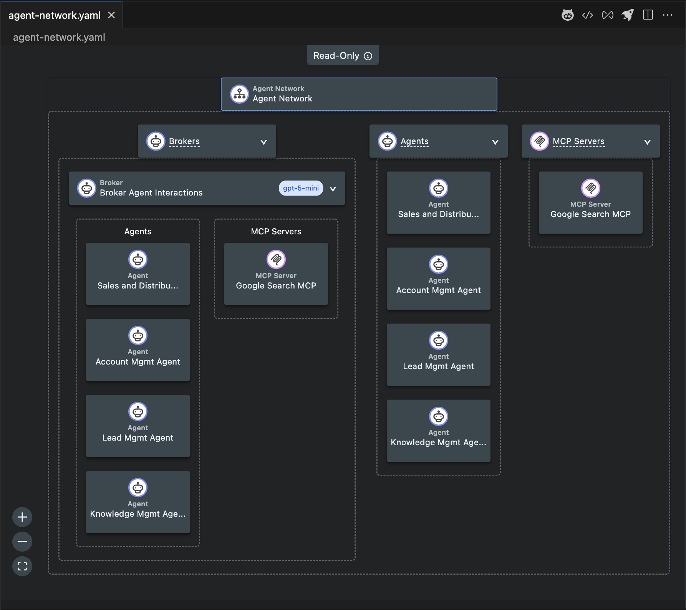

# MuleSoft Agent Fabric - Agent Network Tutorial

## Overview

The **Agent Network Demo** is mainly for learning purposes.

## 🎥 Video Tutorial
[Video Tutorial](https://youtu.be/2g1hzk1mP2I)

## 🏗️ Demo Architecture

This tutorial demonstrates a multi-agent architecture where:
- **Specialized agents** handle specific areas within dedicated business domains (CRM, ERP, HR, etc.)
- **Agent Network** orchestrate and coordinate multiple specialized agents within their responsible domain
- **AI engines** (OpenAI, Einstein AI, Agentforce) power intelligent decision-making
- **MCP servers** provide standardized tool access for agents

## 📁 Applications

### 🤖 Included agent applications (these assets are provided in this repository and must be deployed by you)

The following agent applications are included under the workspace and should be deployed by the user:

- `a2a-030-crm-native-mcp-agent` (CRM agent)
- `a2a-030-erp-native-mcp-agent` (ERP agent)
- `a2a-030-hubspot-agent` (HubSpot / Einstein agent)
- `a2a-030-jira-agent` (Jira / Einstein agent)
- `a2a-030-knowledge-agentforce-agent` (Agentforce knowledge/reservation agent)

## 🔧 Included MCP servers (must be deployed by you)

- `mcp-search-tools` (example MCP server providing search tools)
- `mcp-server-demo-crm` (example MCP server providing CRM tools)
- `mcp-server-demo-erp`(example MCP server providing ERP tools)

## 🛠️ Prerequisites
- Java 17
- MuleSoft Anypoint Studio (for the provided agents and MCP server)
- MuleSoft Anypoint Code Builder (required for the `agent-network-tutorial` project and recommended for the provided agent applications and MCP server)
- MuleSoft Runtime 4.10.x (latest compatible 4.10 release)
- A2A Connector (BETA-0.4.0)
- Inference Connector (latest)
- Einstein Connector (latest)
- Agentforce Connector (latest)
- MCP Connector (latest)
- Managed Flex Gateway (runtime 1.10.2)
- API management licenses (for deploying APIs under management)
- Available vCores/Cores or in-credit Flows for CloudHub/managed runtime usage

> Note: All agent applications and the MCP server listed in this repository are provided as assets; you must build and deploy them into your environment. This README intentionally does not include any external URLs or hosted assets — deployment and hosting are your responsibility.
