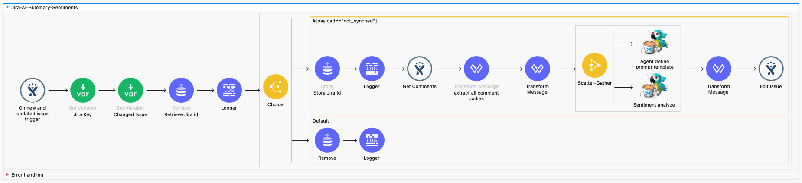
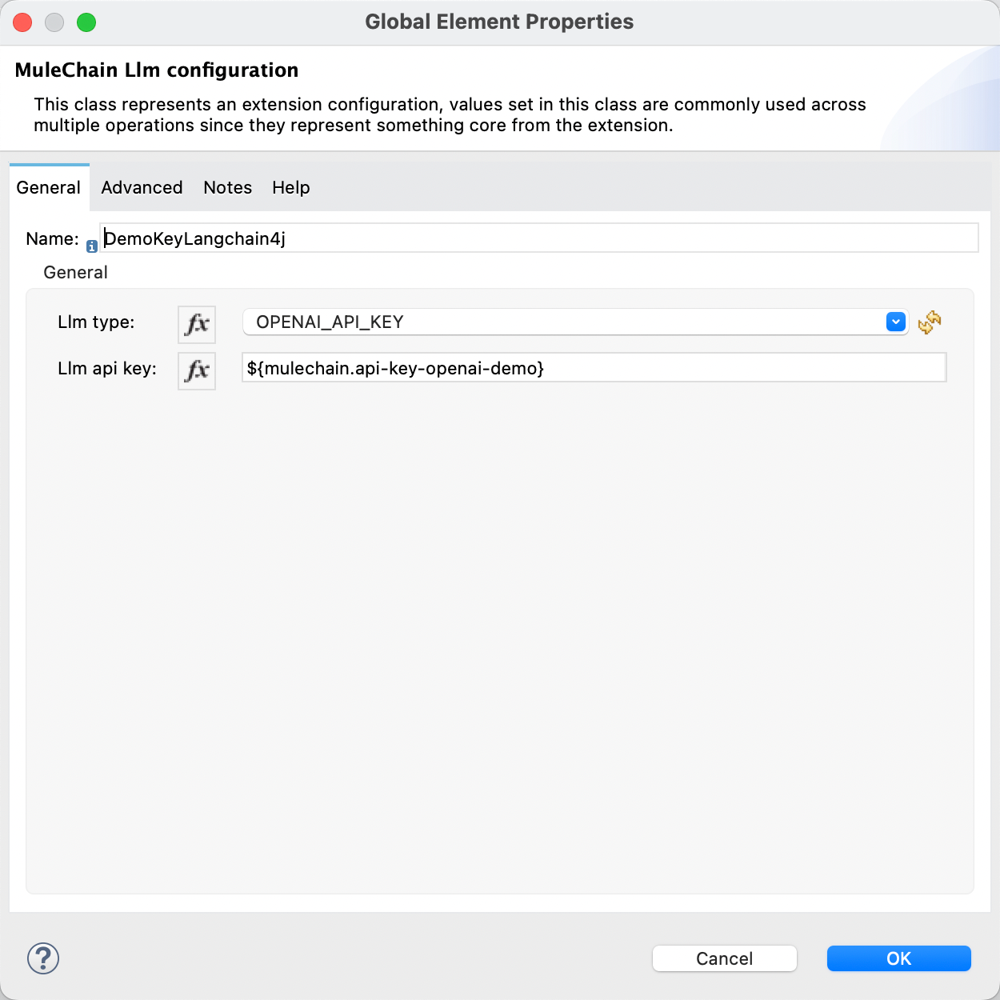
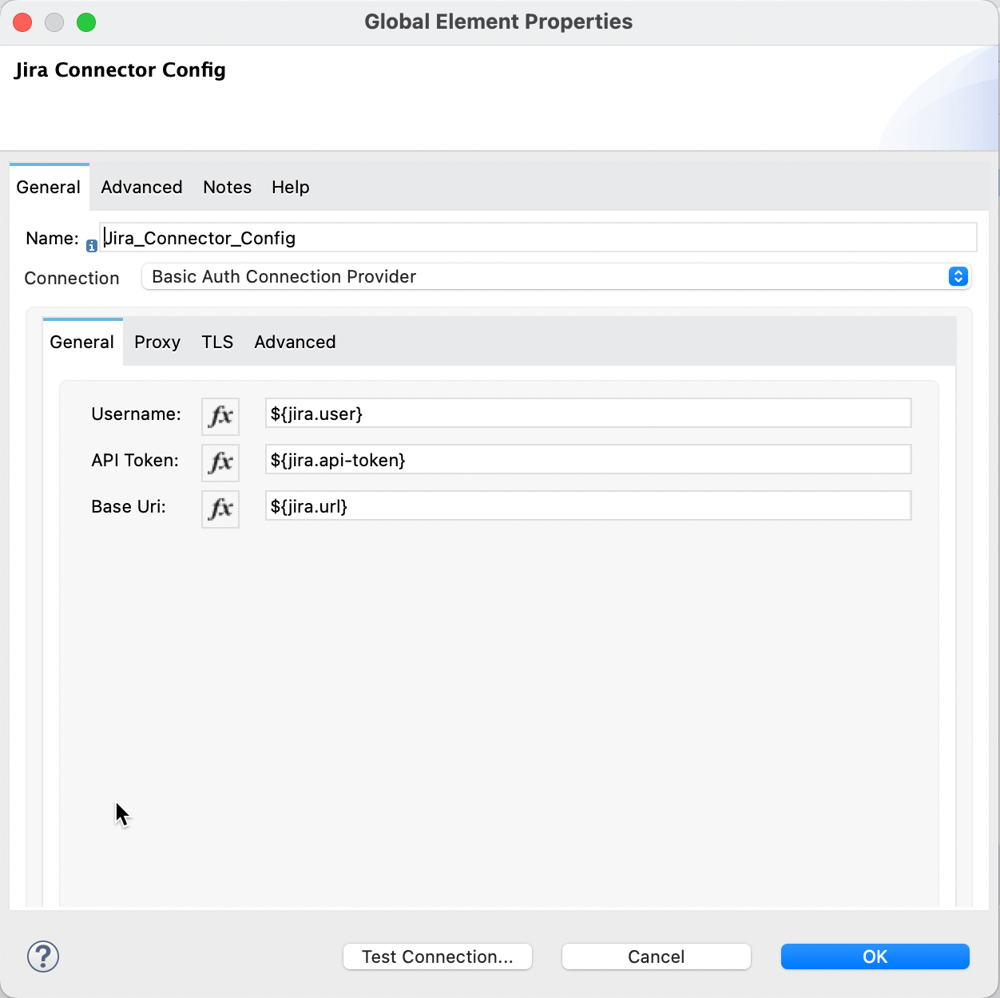
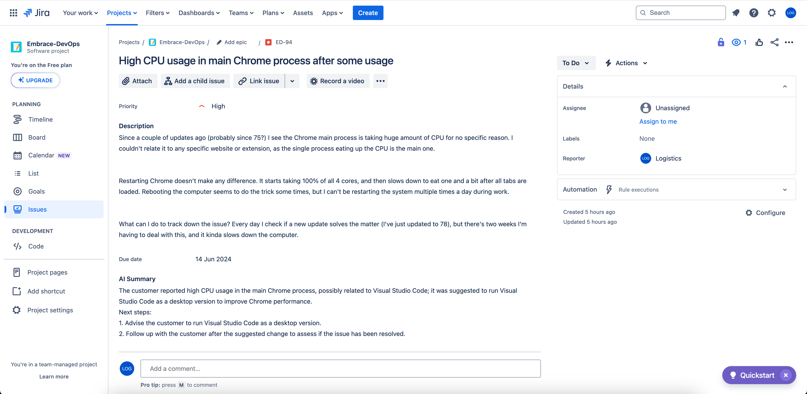

# Jira Bug Agent

This is an example mule app to demonstrate a jira bug agent built with MuleChain Connector. 

The mule flow uses the following connectors:
- MuleChain Connector v0.1.54
- Jira Connector v1.2.11
- ObjectStore v1.2.2


## Systems involved
- The LLM configuration used in this mule flow is **OpenAI**.
- **Jira Cloud** was used to build this mule flow. You can register for the Jira Free Plan for this demo: https://www.atlassian.com/try/cloud/signup?bundle=jira-software&edition=free

## Jira Mule Flow 



This mule flows is tracking each new and/or updated bug in Jira to start the assessment with MuleChain using a defined Prompt Template and Sentiment Analyzer. 


## Configuration
The mule apps maintains a connections.yaml file under ``/jira_bug_agent/src/main/resources/connections.yaml``, which contains all required parameters to establish the connection. Fill out the following configuration to use this Jira agent. 

```yaml
jira:
  url: "{your-jira-baseurl}"
  user: "{your-jira-user}"
  api-token: "{your-api-token}"
  
mulechain:
  api-key-openai: "{your-open-ai-api-key}"
  api-key-openai-demo: "demo"
  api-key-mistralai: "{your-mistral-ai-api-key}"
  base-url-ollama: "{your-base-url-ollama}"
  api-key-anthropic: "{your-anthropic-api-key}"
```

The connections.yaml is mapped to the dedicated connectors in the mule flow. 

### MuleChain configuration
The configuration property `api-key-openai-demo`is linked to the *Llm api key* field in the MuleChain configuration.



### Jira configuration
The configuration property `user`, `api-token`, and `url` are linked to the *Jira Connection Config*. 




#### Additional remarks
- The api token for Jira Cloud can be generated using the following link: https://id.atlassian.com/manage-profile/security/api-tokens
- 2 custom fields need to be created for this mule flow in Jira. 
  - *AI Summary* - field where the flow will write suggestion based on AI
  - *Sentiment* - field to highlight the sentiment of the bug
  - After creating the 2 fields, the technical name need to be replaced in the Transform Message before Editing the Jira issue in the mule flow.


#### Start your app
After configuring the Jira bug agent, let it run and test it out! 




## Watch the demo of the Jira Bug Agent
A demo video to show case the ability of the Jira Bug Agent once deployed in Anypoint Platform. 
[](https://www.youtube.com/watch?v=2Bg8-lAFUxo)


## Author

- [@amirkhan-ak-sf](https://github.com/amirkhan-ak-sf)