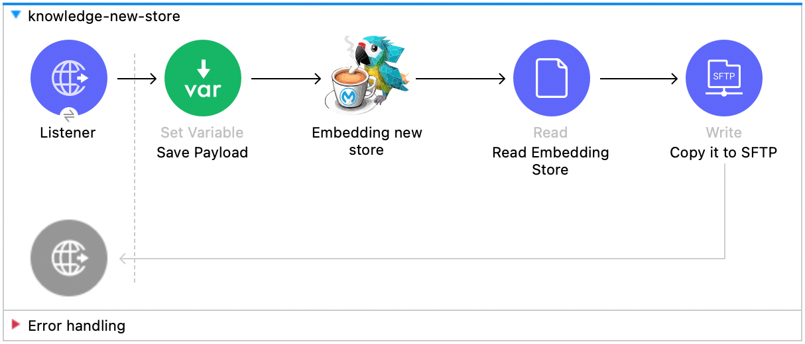
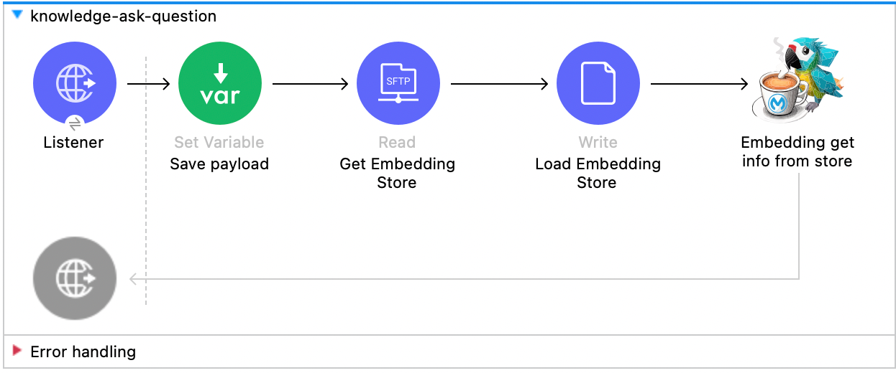
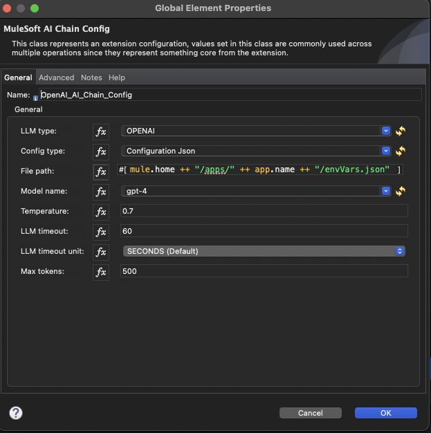
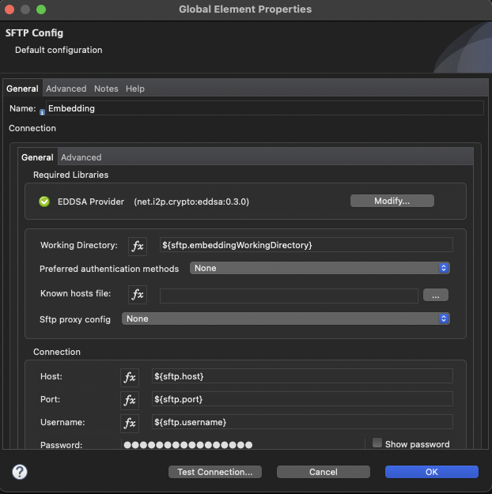
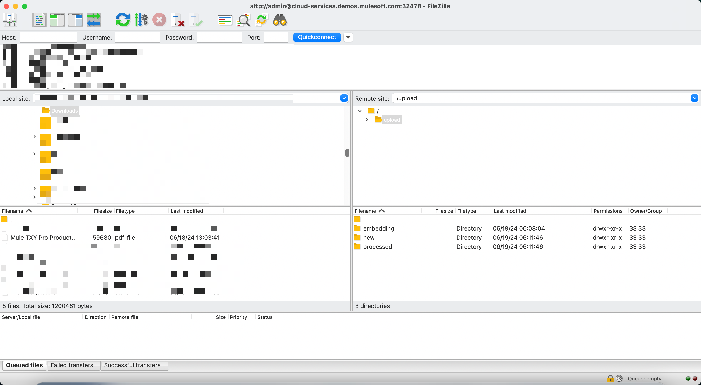

# Knowledge Store

This is an example mule app to demonstrate how to built a knowledge store with MuleChain Connector. 

The mule flow uses the following connectors:
- MuleChain AI Connector v0.1.0
- File Connector 1.5.2
- SFTP Connector 2.1.0


## Systems involved
- The LLM configuration used in this mule flow is **OpenAI** and **MistralAI**.
- You can register for **MistralAI 14 days Free Trial** for this demo: https://mistral.ai/

## Knowledge Store Mule Flow 


This mule app has 3 flows:

**Ingest PDF Files into Knowledge Store**
- ingest-knowledge: This flows take pdf files dropped on the SFTP's upload/new path and ingest it into the knowledge store. The knowledge store is being exported back to the SFTP upload/embedding path. 


**New Store Creation**
- knowledge-new-store: Create a new in-memory Knowledge Store and export it to a physical file on the SFTP Server "upload/embeddings"



**Query Knowledge Store**
- knowledge-ask-question: This flow takes care of questions and queries being asked by the user/consumer.




## Configuration
The configuration contains 2 files to be populated:
- connections.yaml
- envVars.json

### connections.yaml
The mule apps maintains a connections.yaml file under ``/knowledge-store/src/main/resources/connections.yaml``, which contains all required parameters to establish the connection. Fill out the following configuration to use this SFTP Knowledge Store App. 

```yaml
sftp:
  embeddingWorkingDirectory: "/upload/new"
  knowledgeIngestionDirectory: "/upload/embedding"
  host: "sftp.yourcompany.com"
  port: "3859"
  username: "admin"
  password: "MuleChainAiConnector"
```

The connections.yaml is mapped to the dedicated connectors in the mule flow. 

### envVars.json
All LLM configuration properties are under ``/knowledge-store/src/main/resources/envVars.json``, which contains all required parameters for the LLM. Fill out the following configuration for the LLM of your need. Note, that only the six LLMs are currently supported.

```json
{
    "OPENAI": {
        "OPENAI_API_KEY": "YOUR_OPENAI_API_KEY"
    },
    "MISTRAL_AI": {
        "MISTRAL_AI_API_KEY": "YOUR_MISTRAL_AI_API_KEY"
    },
    "OLLAMA": {
        "OLLAMA_BASE_URL": "http://baseurl.ollama.com"
    },
    "ANTHROPIC": {
        "ANTHROPIC_API_KEY": "YOUR_ANTHROPIC_API_KEY"
    },
    "AZURE_OPENAI": {
        "AZURE_OPENAI_KEY": "YOUR_AZURE_OPENAI_KEY",
        "AZURE_OPENAI_ENDPOINT": "http://endpoint.azure.com",
        "AZURE_OPENAI_DEPLOYMENT_NAME": "YOUR_DEPLOYMENT_NAME"
    }
}
```

### MuleChain configuration
In the MuleChain LLM Configuraiton, you have to select the LLM type from the dropdown, the configuraiton type must be set to *Configuration Json* and the *File path* must set to the path of the ``/knowledge-store/src/main/resources/envVars.json``. To make it dynamically linked to the resources, you can use the dataweave statement ```mule.home ++ "/apps/" ++ app.name ++ "/envVars.json"```. All relevant informations are extracted from the **envVars.json** during runtime. 

The mule app contains 2 MuleChain AI configuration for **OpenAI and MistralAI**.



### SFTP configuration
The configuration property `host`, `port`, `username`, and `password` are linked to the *SFTP Connection Config*. 



#### Start your app
After configuring the Knowledge Store Mule App, let it run and test it out! 




## Watch the demo of the Knowledge Store Mule App
A demo video to show case the ability of the Knowledge Store once deployed in Anypoint Platform. 

[](https://youtu.be/b7dUyxB7Lqc?si=lSo5X_GbxzQRA4c8)


## Author

- [@amirkhan-ak-sf](https://github.com/amirkhan-ak-sf)