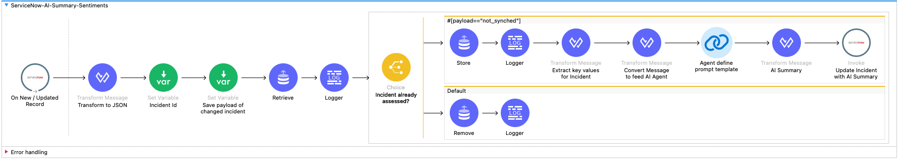
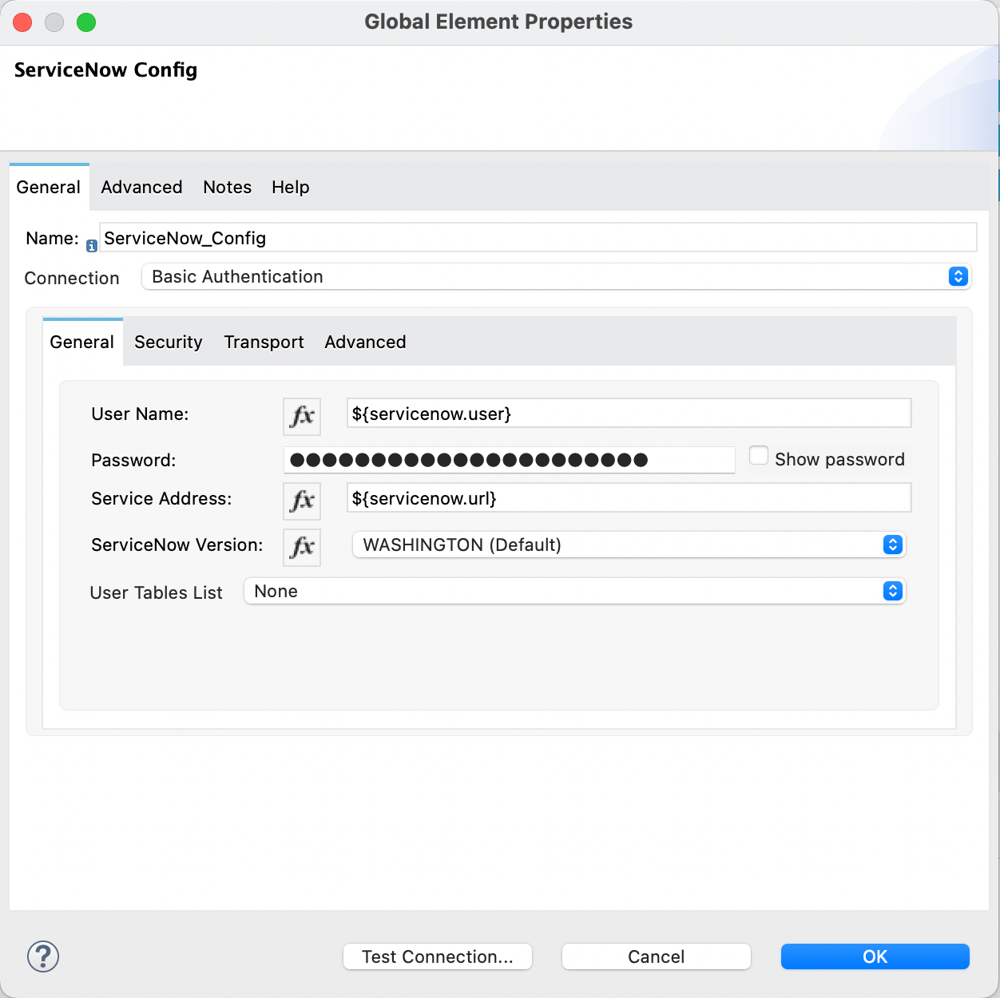
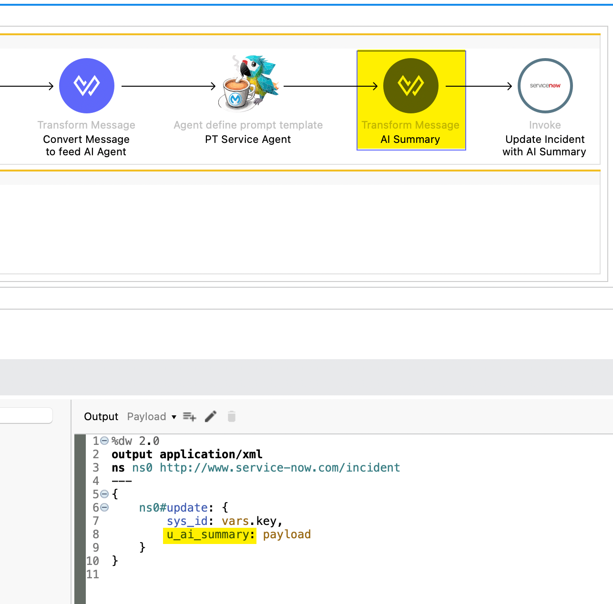
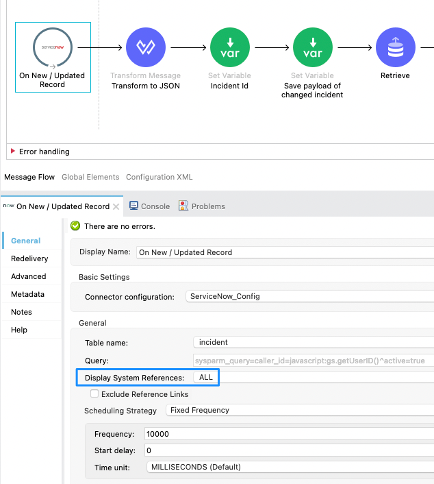
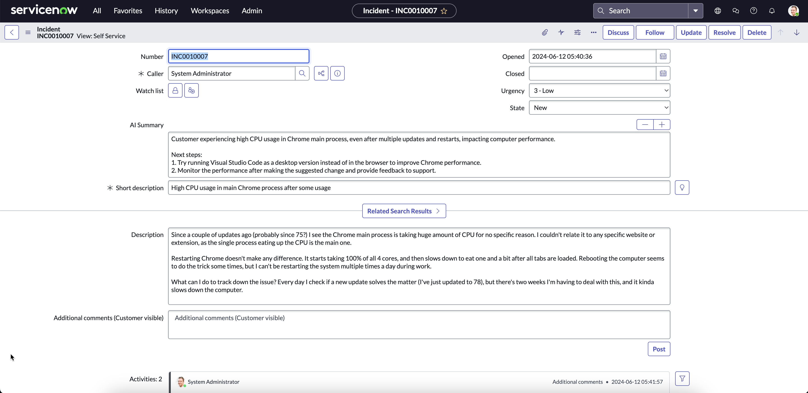

# ServiceNow Incident Agent

This is an example mule app to demonstrate a servicenow incident agent built with MuleChain Connector. 

The mule flow uses the following connectors:
- MuleChain Connector v0.1.54
- ServiceNow Connector v6.16
- ObjectStore v1.2.2


## Systems involved
- The LLM configuration used in this mule flow is **OpenAI**.
- **ServiceNow Free Instance** was used to build this mule flow. You can register for the ServiceNow Free Instance for this demo: https://developer.servicenow.com/

## ServiceNow Mule Flow 



This mule flows is tracking each new and/or updated incident in ServiceNow to start the assessment with MuleChain using a defined Prompt Template. 


## Configuration
The configuration contains 2 files to be populated:
- connections.yaml
- envVars.json

### connections.yaml
The mule apps maintains a connections.yaml file under ``/Service_Now_incident_agent/src/main/resources/connections.yaml``, which contains all required parameters to establish the connection. Fill out the following configuration to use this ServiceNow agent. 

```yaml
servicenow:
  url: "https://{your-servicenow-instance}.service-now.com/"
  user: "{your-servicenow-password}"
  password: "{your-servicenow-password}"
```

The connections.yaml is mapped to the dedicated connectors in the mule flow. 

### envVars.json
All LLM configuration properties are under ``/Service_Now_incident_agent/src/main/resources/envVars.json``, which contains all required parameters for the LLM. Fill out the following configuration for the LLM of your need. Note, that only the six LLMs are currently supported.


```json
{
    "OPENAI": {
        "OPENAI_API_KEY": "YOUR_OPENAI_API_KEY"
    },
    "MISTRAL_AI": {
        "MISTRAL_AI_API_KEY": "YOUR_MISTRAL_AI_API_KEY"
    },
    "OLLAMA": {
        "OLLAMA_BASE_URL": "http://baseurl.ollama.com"
    },
    "ANTHROPIC": {
        "ANTHROPIC_API_KEY": "YOUR_ANTHROPIC_API_KEY"
    },
    "AZURE_OPENAI": {
        "AZURE_OPENAI_KEY": "YOUR_AZURE_OPENAI_KEY",
        "AZURE_OPENAI_ENDPOINT": "http://endpoint.azure.com",
        "AZURE_OPENAI_DEPLOYMENT_NAME": "YOUR_DEPLOYMENT_NAME"
    }
}
```

### MuleChain configuration
In the MuleChain LLM Configuraiton, you have to select the LLM type from the dropdown, the configuraiton type must be set to *Configuration Json* and the *File path* must set to the path of the ``/Service_Now_incident_agent/src/main/resources/envVars.json``. To make it dynamically linked to the resources, you can use the dataweave statement ```mule.home ++ "/apps/" ++ app.name ++ "/envVars.json"```. All relevant informations are extracted from the **envVars.json** during runtime. 


### ServiceNow configuration
The configuration property `user`, `password`, and `url` are linked to the *ServiceNow Connection Config*. 



#### Custom Field (*AI Summary*)
1 custom field need to be created for this mule flow in ServiceNow. 
- *AI Summary* - field where the flow will write suggestion based on AI
- After creating the field, the technical name need to be replaced in the Transform Message before Editing the ServiceNow incident in the mule flow.




#### Modify ServiceNow Trigger
Make sure the trigger to shows ALL in the *System Reference* field. This is important to get the comments and notes in the flow.



#### Start your app
After configuring the ServiceNow incident agent, let it run and test it out! 




## Watch the demo of the ServiceNow Incident Agent
A demo video to show case the ability of the ServiceNow Incident Agent once deployed in Anypoint Platform. 

[](https://youtu.be/Af1Abxp-zZ8?feature=shared)


## Author

- [@amirkhan-ak-sf](https://github.com/amirkhan-ak-sf)