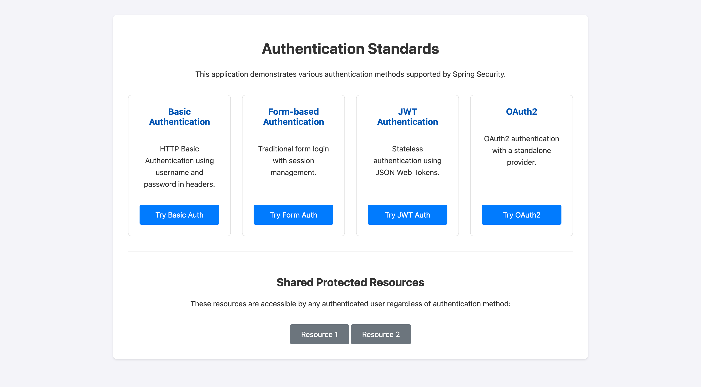
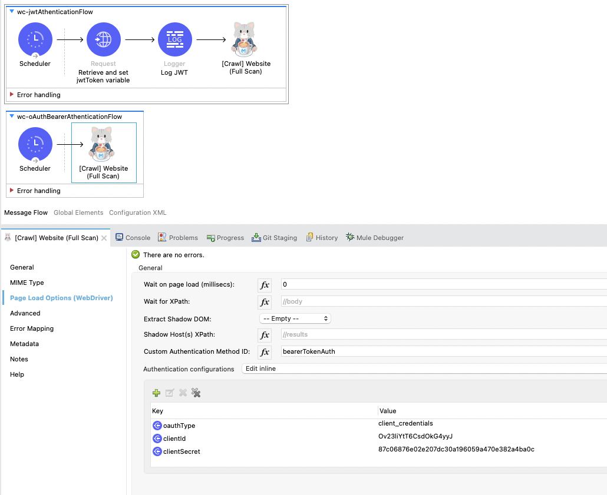

# Mule WebCrawler Authentication Demo

This project demonstrates various authentication mechanisms for web crawling using the MuleSoft WebCrawler Connector. It consists of two sub-projects:

1.  **`spring-authentication`**: A Spring Boot application that provides a set of web pages protected by different authentication methods.
2.  **`wc-authentication`**: A Mule application that uses the MuleSoft WebCrawler Connector to crawl the pages served by the `spring-authentication` project, showcasing how to configure the connector for each authentication type.

---

## 1. `spring-authentication` Project

This project is a demonstration of various authentication mechanisms implemented using Spring Boot and Spring Security. Each authentication method is isolated into its own security filter chain and has its own set of UI pages.



### Features

This application showcases the following authentication methods:

-   **HTTP Basic Authentication**
-   **Form-Based Authentication**
-   **JWT (JSON Web Token) Authentication**
-   **OAuth 2.0**

For more details, please refer to the [`spring-authentication/README.md`](spring-authentication/README.md).

---

## 2. `mule-webcrawler-authentication` Project

This Mule application demonstrates how to use the MuleSoft WebCrawler Connector to crawl websites that require authentication. Each flow in the project is configured to handle a different authentication scheme provided by the `spring-authentication` application.

### Demonstrated Crawling Flows

The `wc-authentication.xml` file contains the following example flows:

-   **Basic Authentication (`wc-basicOrDigestAthenticationFlow`)**:
    -   Crawls: `http://localhost:8087/basic/home`
    -   Method: Uses `basicOrDigestAuth` with a configured username and password.

-   **Form-Based Authentication (`wc-formCookieAthenticationFlow`)**:
    -   Crawls: `http://localhost:8087/form/home`
    -   Method: Uses `formCookieAuth`. The connector is configured with the login URL, username, password, and a CSS selector for the submit button. It automatically handles the login form submission and subsequent session cookies.

-   **JWT (JSON Web Token) Authentication (`wc-jwtAthenticationFlow`)**:
    -   Crawls: `http://localhost:8087/jwt/about`
    -   Method: Uses `jwtAuth`. The flow first makes a separate HTTP request to the JWT login endpoint to retrieve a token, which is then passed to the WebCrawler Connector.

-   **OAuth 2.0 Bearer Token (`wc-oAuthBearerAthenticationFlow`)**:
    -   Crawls: `http://localhost:8087/oauth/home`
    -   Method: Uses `bearerTokenAuth`. The connector is configured with the `client_credentials` grant type, along with the client ID and secret, to automatically fetch and use an OAuth 2.0 bearer token.

**PLEASE NOTE: MFA based authentication is not supported.**

Sample configurations for each authentication flow are present in the **'Page Load Options (WebDriver)'** tab as shown below.



---

## Getting Started

### Prerequisites

-   Java 17 or later
-   Maven 3.6 or later
-   Anypoint Studio (for the Mule project)

### Running the Demo

1.  **Start the Spring Authentication Service:**
    -   Before running, please ensure the port in `spring-authentication/src/main/resources/application.yml` is set to `8087`:
        ```yaml
        server:
          port: 8087
        ```
    -   Navigate to the `spring-authentication` directory and run the application:
        ```bash
        cd spring-authentication
        mvn clean install
        mvn spring-boot:run
        ```

2.  **Run the Mule WebCrawler Project:**
    -   Open the `mule-webcrawler-authentication` project in Anypoint Studio.
    -   Run the application in `DEBUG` mode.
    -   Each flow is triggered by a scheduler set to a very long interval. To test a specific flow, you can trigger it manually while running in DEBUG mode.
